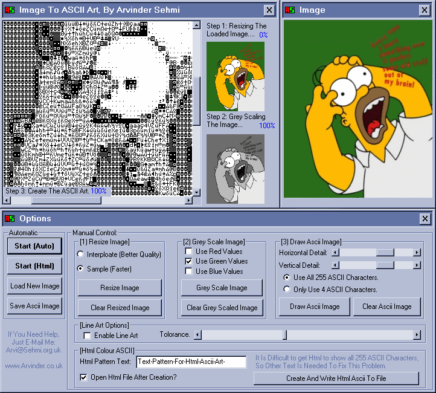



## Ascii Art 5 \(Updated Version\)

### Description

Originally made by Arvinder Sehmi this is the updated version. Enjoy.
 
### More Info
 

             |
---                |---
**Submitted On**   |2000-11-06 16:46:28
**By**             |[Matt Kneale](https://github.com/Planet-Source-Code/PSCIndex/blob/master/ByAuthor/matt-kneale.md)
**Level**          |Advanced
**User Rating**    |3.7 (11 globes from 3 users)
**Compatibility**  |VB 6\.0
**Category**       |[Complete Applications](https://github.com/Planet-Source-Code/PSCIndex/blob/master/ByCategory/complete-applications__1-27.md)
**World**          |[Visual Basic](https://github.com/Planet-Source-Code/PSCIndex/blob/master/ByWorld/visual-basic.md)
**Archive File**   |[Ascii\_Art\_1707572122004\.zip](https://github.com/Planet-Source-Code/matt-kneale-ascii-art-5-updated-version__1-51689/archive/master.zip)

